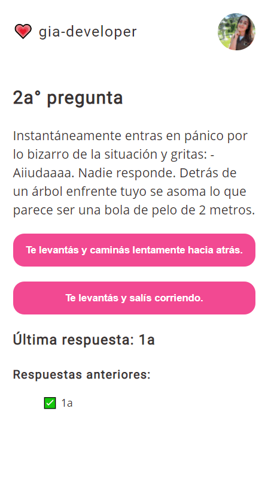
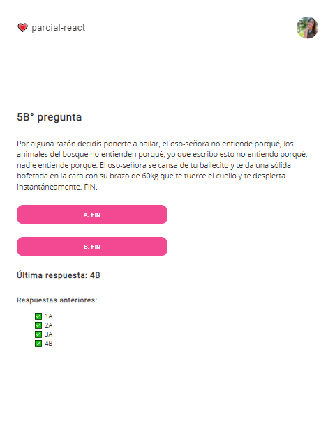
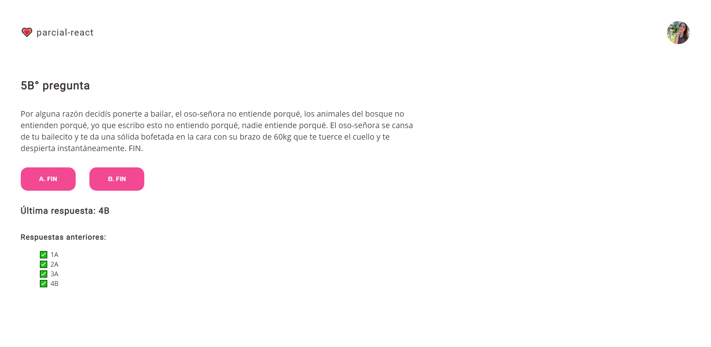

# Elige tu propia aventura 🚀

Mini App realizada con React.

<h2>Incluye los siguientes temas</h2>

● Componentes de clase  
● Props  
● Estados  
● Key props y .map()  
● Ciclo de vida

<h2>También incluye las siguientes librerías</h2>

● SweetAler2  
● Animate.css

<h2>¡Además es Mobile First!</h2>
● Mobile: hasta 767px  
● Tablet: hasta 1023px  
● Desktop: incluye se adapta a 1920px 😎

<h2>Preview de la App</h2>

<h3>Mobile</h3>

<h3>Tablet</h3>

<h3>Desktop</h3>

